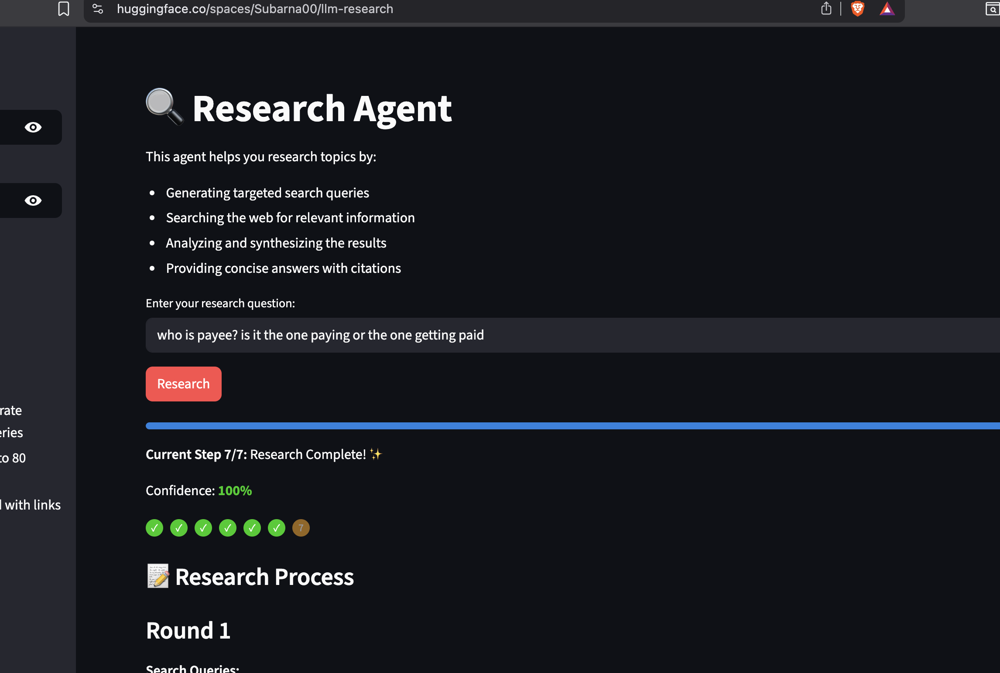
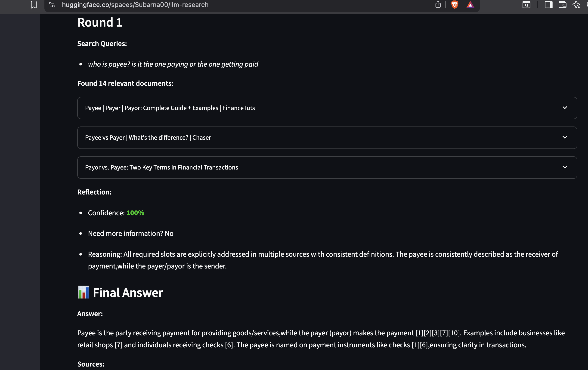
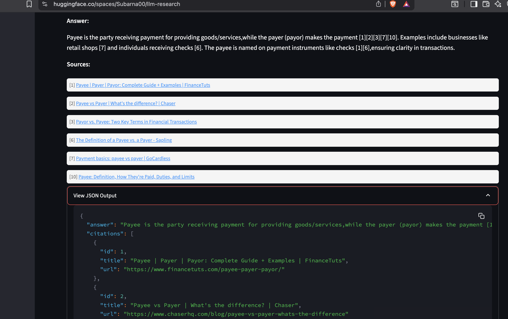

# LLM Research Agent

A robust research agent that leverages LLMs and web search to provide concise, factual answers with citations.
Access the deployed version of this app here: [https://subarna00-llm-research.hf.space/](https://subarna00-llm-research.hf.space/)

Here's how the app looks:

**Home Screen**


**Research Process**


**Final Answer with Citations**



## Table of Contents
1. [Architecture & Design](#architecture--design)
2. [Core Components](#core-components)
3. [Setup & Installation](#setup--installation)
4. [Testing](#testing)
5. [Trade-offs & Decisions](#trade-offs--decisions)
6. [Future Improvements](#future-improvements)

## Architecture & Design

### High-Level Flow
```ascii
┌──────────────┐     ┌──────────────┐     ┌──────────────┐     ┌──────────────┐
│   Generate   │     │  Web Search  │     │   Reflect    │     │  Synthesize  │
│   Queries    │────▶│    Tool     │────▶│    Node      │────▶│    Node      │
└──────────────┘     └──────────────┘     └──────────────┘     └──────────────┘
       ▲                                         │
       └─────────────────────────────────────────┘
              (Additional queries if needed)
```

### Component Responsibilities
1. **Generate Queries**
   - Breaks down user question into 3-5 search queries
   - Uses LLM to ensure diverse coverage
   - Returns JSON array of queries

2. **Web Search Tool**
   - Concurrent execution of queries
   - Result deduplication
   - Fallback to mock data when API unavailable

3. **Reflect Node**
   - Analyzes search results
   - Determines if more information needed
   - Generates refined queries if necessary

4. **Synthesize Node**
   - Generates concise (<80 words) answer
   - Adds proper citations
   - Returns formatted JSON response

## Core Components

### 1. Query Generation
```python
def generate_queries(question: str) -> List[str]:
    """
    Generates 3-5 search queries from user question.
    Uses Groq LLM for query generation.
    """
```

Key features:
- Semantic understanding of question
- Query diversity
- Error handling with fallbacks

### 2. Web Search
```python
def search_all(queries: list[str]) -> list[dict]:
    """
    Concurrent web search with deduplication.
    Supports both Tavily API and mock results.
    """
```

Features:
- URL-based deduplication
- Concurrent execution
- Mock fallback

### 3. Reflection
```python
def reflect(question: str, documents: List[Dict]) -> Dict:
    """
    Analyzes search results and determines next steps.
    Supports slot-based information tracking.
    """
```

Features:
- Information completeness check
- Confidence scoring
- Query refinement

### 4. Synthesis
```python
def synthesize(question: str, documents: List[Dict]) -> Dict:
    """
    Generates final answer with citations.
    Enforces 80-word limit and citation format.
    """
```

Features:
- Word limit enforcement
- Citation validation
- JSON structure validation

## Setup & Installation

### Prerequisites
- Docker
- Python 3.9+
- API Keys:
  - GROQ_API_KEY
  - TAVILY_API_KEY (optional)

### Installation Steps
1. Clone repository:
```bash
git clone <repository-url>
cd llm-research-agent
```

2. Set environment variables:
```bash
cp .env.example .env
# Edit .env with your API keys
```

3. Build and run:
```bash
docker compose build
docker compose run --rm agent "Your question here"
```

### Running Web Interface
```bash
docker compose up web
```

## Testing

### Running Tests
```bash
# Run all tests
docker compose run --rm agent pytest -v tests/

# Run specific test
docker compose run --rm agent pytest -v tests/test_main.py::test_happy_path

# Run with coverage
docker compose run --rm agent pytest --cov=agent --cov-report=html tests/
```

### Test Categories
1. **Unit Tests**
   - Query generation
   - Web search functionality
   - Reflection logic
   - Synthesis formatting

2. **Integration Tests**
   - Happy path flow
   - Error handling
   - Two-round search

3. **Mock Tests**
   - API failures
   - Rate limiting
   - Timeouts

## Trade-offs & Decisions

### 1. LLM Provider (Groq)
Pros:
- Fast inference
- Good pricing
- Reliable API

Cons:
- Less mature than alternatives
- Limited model options

### 2. Search Implementation
Pros:
- Concurrent execution
- Efficient deduplication
- Mock fallback

Cons:
- Higher API costs
- Complex error handling

### 3. Testing Strategy
Pros:
- Comprehensive mocking
- Fast execution
- Reliable results

Cons:
- Limited real API testing
- May miss integration issues

### 4. Architecture Choices
Pros:
- Clear separation of concerns
- Easy to extend
- Well-defined interfaces

Cons:
- Some component coupling
- State management complexity

## Future Improvements

### 1. Performance
- [ ] Add Redis caching for search results
- [ ] Implement request batching
- [ ] Add response streaming

### 2. Reliability
- [ ] Add circuit breakers
- [ ] Implement retry logic
- [ ] Add rate limiting

### 3. Monitoring
- [ ] Add structured logging
- [ ] Implement metrics collection
- [ ] Add tracing

### 4. Features
- [ ] Support more search providers
- [ ] Add result ranking
- [ ] Implement source verification

### 5. Testing
- [ ] Add performance benchmarks
- [ ] Increase coverage
- [ ] Add integration test suite

## Contributing
1. Fork repository
2. Create feature branch
3. Add tests
4. Submit pull request

## License
MIT License 

### Key Components

1. **Query Generation**
   - Takes user question
   - Generates 3-5 targeted search queries
   - Uses LLM to ensure comprehensive coverage

2. **Web Search**
   - Runs concurrent searches for efficiency
   - Deduplicates results by URL
   - Falls back to mock data if API unavailable

3. **Reflection**
   - Analyzes search results
   - Decides if more information needed
   - Generates refined queries if necessary

4. **Synthesis**
   - Creates concise answer (≤80 words)
   - Adds numbered citations [1][2]
   - Returns JSON with answer and sources

## Design Decisions & Trade-offs

### 1. LLM Provider (Groq)
✅ **Pros**
- Fast inference speed
- Competitive pricing
- Reliable API

❌ **Cons**
- Newer provider
- Limited model selection
- Less community support

**Why Groq?** Balanced performance and cost, with good reliability for our use case.

### 2. Search Implementation
✅ **Pros**
- Concurrent execution reduces latency
- Deduplication saves costs
- Mock fallback enables offline testing

❌ **Cons**
- More complex error handling
- Higher initial API costs
- Requires careful rate limiting

**Decision**: Prioritized response speed and result quality over implementation simplicity.

### 3. Two-Round Search
✅ **Pros**
- Better answer completeness
- Handles complex questions
- Self-correcting

❌ **Cons**
- Longer response time
- Higher API usage
- More complex logic

**Implementation**: Limited to max 2 rounds to balance completeness vs speed.

## Testing Strategy

### 1. Required Test Cases
- Happy path (successful flow)
- No search results
- HTTP 429 (rate limit)
- Timeout handling
- Two-round search

### 2. Additional Coverage
- Query generation limits
- Result deduplication
- Word count limits
- Citation formatting

### 3. Test Commands
```bash
# Run all tests
docker compose run --rm agent pytest -v tests/

# Run specific test
docker compose run --rm agent pytest -v tests/test_main.py::test_happy_path
```

## Setup & Usage

### Prerequisites
- Docker
- GROQ_API_KEY
- TAVILY_API_KEY (optional)

### Quick Start
1. Clone and setup:
```bash
git clone <repo>
cd llm-research-agent
cp .env.example .env
# Add API keys to .env
```

2. Run:
```bash
docker compose run --rm agent "Who won the 2022 FIFA World Cup?"
```

3. Example output:
```json
{
  "answer": "Argentina won the 2022 FIFA World Cup, beating France on penalties after a 3-3 draw in extra time.[1]",
  "citations": [
    {
      "id": 1,
      "title": "FIFA World Cup 2022 Final",
      "url": "https://example.com/world-cup-2022"
    }
  ]
}
```

## Limitations and Hallucination Risks

### Current Safeguards
1. **Basic Citation Validation**
   - Ensures every citation in answer maps to a source
   - Validates citation format [1][2]
   - Links citations to original URLs

2. **Information Tracking**
   - Uses slot-based tracking for required information
   - Identifies missing information
   - Triggers additional searches when needed

### Known Risks
1. **Content Verification Gaps**
   - No cross-source fact verification
   - No temporal consistency checking
   - No numerical claim validation

2. **Hallucination Types**
   - May combine facts incorrectly
   - Could generate plausible but incorrect details
   - Might infer relationships not stated in sources

### Future Work Needed
1. **Enhanced Validation**
   - Implement cross-source fact checking
   - Add temporal consistency validation
   - Verify numerical claims

2. **Improved Controls**
   - Add conservative language requirements
   - Implement date context validation
   - Add source credibility scoring